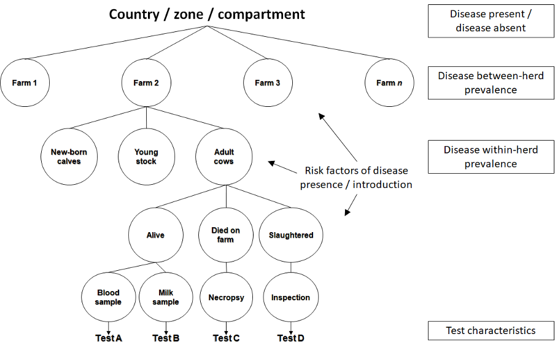

```{r setup, include=FALSE}
options(htmltools.dir.version = FALSE)
```

class: inverse, center, middle

# Objectives of the presentation

---
# Objectives

By the end of this presentation, you should understand:

- the main epidemiological and statistical considerations for the estimation of a probability of freedom from infection

- the principles of some of the methods used, their advantages and limitations

---
class: inverse, center, middle

# Freedom from infection as a statistical problem

---
## Freedom from infection as a statistical problem

- Evidence of infection sought by testing animals from the population of interest

--

 - Testing all the animals is usually too costly $\rightarrow$ sampling
 
--

 - $\geq 1$ (true) positive $\rightarrow$ infection is present
 
--

 - 0 test positive $\rightarrow$ infection is absent OR infection is present, but no infected included in the sample

--


- Most of the time, the problem consists in **quantifying the probability that the infection is not present given that it has not been detected**

--

- The question can be formulated as: 

 - **how sure are we that the infection is truly absent given that we did not find it?** or

 - **what is the probability of a false negative surveillance outcome?**

---
## Freedom from infection as a statistical problem

- Consider a large population in which 20% of animals are infected

- 10 animals of this population are tested with a perfect test

- Below is the distribution of the number of positives we would get if we could take many samples of 10 animals

```{r, echo = FALSE, fig.width = 12, fig.height = 6}
limy <- c(0, .35)
x <- dbinom(0:10, 10, .2)
barplot(x, ylim = limy,
        names.arg = 0:10,
        xlab = "Number of test positives out of 10 animals tested", 
        cex.lab = 1.5)
```
---
## Freedom from infection as a statistical problem

- Consider a large population in which 20% of animals are infected

- 20 animals of this population are tested with a perfect test

- Below is the distribution of the number of positives we would get if we could take many samples of 20 animals

```{r, echo = FALSE, fig.width = 12, fig.height = 6}
x <- dbinom(0:10, 20, .2)
barplot(x, ylim = limy,
        names.arg = 0:10,
        xlab = "Number of test positives out of 20 animals tested", 
        cex.lab = 1.5)
```

---
## Freedom from infection as a statistical problem

- Consider a large population in which 1% of animals are infected

- 20 animals of this population are tested with a perfect test

- Below is the distribution of the number of positives we would get if we could take many samples of 20 animals

```{r, echo = FALSE, fig.width = 12, fig.height = 6}
x <- dbinom(0:10, 20, .01)
barplot(x,
        names.arg = 0:10,
        xlab = "Number of test positives out of 20 animals tested", 
        cex.lab = 1.5)
```

---
## Freedom from infection as a statistical problem

- When testing 10 animals in a population with a prevalence of infection of 20%, there is a 10.7% chance of getting no test positive

 - The probability of a false negative surveillance outcome is:

$$p(X = 0| n = 10, \pi = 0.2) = 0.107$$

--

- When testing 20 animals in a population with a prevalence of infection of 20%, the probability of a false negative surveillance outcome is:

$$p(X = 0| n = 20, \pi = 0.2) = 0.01$$

--

- When testing 20 animals in a population with a prevalence of infection of 1%, the probability of a false negative surveillance outcome is:

$$p(X = 0| n = 20, \pi = 0.01) = 0.818$$

--

- What happens if the prevalence is 0?

---
## Freedom from infection as a statistical problem

- Probability of a false negative surveillance outcome $\nearrow$ when:

 - sample size $\searrow$
 
 - prevalence $\searrow$
 
--

- But usually, the **true prevalence** is not known

 - We now how to estimate $p(X = 0|n, \pi)$
 
 - We would like to know $p(\pi = 0| X = 0, n)$


---
class: inverse, center, middle


---
## Freedom from infection as a statistical problem

- Chosen approach: use of a **design prevalence**

--

- Principle:

 - Assume that the disease is present at some chosen prevalence $\pi_t$, called the *design prevalence*
 
 - Make hypotheses that can be tested from this design prevalence

 $$H_o: \pi \geq \pi_t$$
 $$H_A: \pi < \pi_t$$
 
--
 
 - Construct confidence intervals, estimate probabilities of error from these hypotheses

```{r, echo = FALSE, message=FALSE}
magick::image_read_pdf("./tables/tab_error_1.pdf")
```

---
## What is a probability, **frequentist version**

- Probabilities as frequencies of events

--

- The probability of drawing an infected animal when randomly sampling from a large population is the infection prevalence
 
--

- When estimating prevalence by randomly sampling from a large population, the estimation will get closer to the true prevalence as sample size increases

---
## What is a probability, **Bayesian version**

- Probabilities as hypotheses derived from evidence, knowledge or belief

--

- The probability of foot and mouth disease being introduced in Sweden cannot be estimated from past occurrences

 - Plausible values for this probability of introduction could be proposed by considering all the possible routes of introduction and adding the probabilities of occurrence of each one
 
--

- Rare / emerging events have small probabilities of occurrence that prevent the estimation of frequencies 

--

$\Rightarrow$ In essence, quantifying a probability of freedom from infection from absence of evidence of presence can be seen as a Bayesian problem: what is the probability of absence of infection given the data and the assumptions made?

--

- Bayes' theorem:

$$p(\pi|X) = \frac{p(X|\pi)p(\pi)}{p(X)}$$

---
class: inverse, center, middle

# Output-based standards


---
## Output-based standards

- Objective of output-based surveillance: produce outputs that are independent of the input and method of analysis used

--

- What are these outputs?

 - (Specificity of surveillance)
 
 - Sensitivity of surveillance
 
 - Probability of freedom from infection
 
 - Expected cost of error
 
 - $\ldots$

--

```{r, echo = FALSE, message=FALSE}
magick::image_read_pdf("./tables/tab_error_2.pdf")
```

---
## Specificity of surveillance

- Probability of a negative surveillance outcome when the infection is absent (true negative):

 $$SSp = p(O^-|D^-)$$

 - Usually assumed to be 1 (i.e. no false positive) $\rightarrow$ every positive test will be investigated until either proven to be a false positive or confirmed as a true positive
 
```{r, echo = FALSE, message=FALSE}
magick::image_read_pdf("./tables/tab_error_2.pdf")
```

---
## Sensitivity of surveillance

- Probability of a positive surveillance outcome when the infection is present (at the design prevalence)

 $$SSe = p(O^+|D^+)$$

```{r, echo = FALSE, message=FALSE}
magick::image_read_pdf("./tables/tab_error_2.pdf")
```

---
## Probability of freedom from infection

- Probability that the infection is absent when the outcome of surveillance is negative

  $$P_{free} = p(D^-|O^-)$$


```{r, echo = FALSE, message=FALSE}
magick::image_read_pdf("./tables/tab_error_2.pdf")
```

- is in fact the negative predictive value

  $$P_{free} = \frac{SSp.(1 - \pi_t)}{SSp.(1 - \pi_t) + (1-SSe) . \pi_t}$$
  
---
## Probability of freedom from infection

- Probability that the infection is absent when the outcome of surveillance is negative

  $$P_{free} = p(D^-|O^-)$$


```{r, echo = FALSE, message=FALSE}
magick::image_read_pdf("./tables/tab_error_3.pdf")
```

- since $SSp = 1$, can be written as:

  $$P_{free} = \frac{1 - \pi_t}{1-SSe.\pi_t}$$

---
## Expected cost of error

- Estimation of the cost of undetected infections

 $$ECE = (1 - P_{free}) . Cost_{error}$$
 
- Can be used to justify the total cost of surveillance

 $$TSC = Cost_{surveillance}+(1 - P_{free}).Cost_{error}$$

--
- Who is paying?

 - Cost for the seller or buyer?

 - Spread of infection, public health, lost markets $\ldots$


---
## Other outputs

- More recently, indicators of early detection considered, although not strictly related to infection freedom

 - Influence on the cost of error $\rightarrow$ the longer the time between introduction of infection, the higher the resulting costs


---
class: inverse, center, middle

# Disease prevalence context and surveillance objectives

---
## Impact of disease prevalence context on surveillance objectives

1. Infection is absent from area (e.g. BVDV in Scandinavian countries)
 
 - **Objective of surveillance =** prove to trading partners that it is safe to trade with you
 
 - **Level at which proof of freedom is sought =** whole area
 
--

1. Infection is still present (e.g. BVDV in France)

 - **Objective of surveillance =** identify herds / regions that are safe to trade with
 
 - **Level at which proof of freedom is sought =** herd / region
 
 - **Inference =** some epidemiological quantities of interest can be learned from data and incorporated into the prediction of presence of infection


---
class: inverse, center, middle

# Factors affecting the performance of surveillance

---
## Factors affecting the performance of surveillance

- Test characteristics

- Surveillance components

- Frequency of testing

---
## Test Characteristics

- **Sensitivity**: probability of a positive test result ( $T^+$ ) given (|) presence of infection ( $I^+$ )

$$Se = p(T^+|I^+)$$

- **Specificity**: probability of a negative test result ( $T^-$ ) given (|) absence of infection ( $I^-$ )

$$Sp = p(T^-|I^-)$$


--

- Defined at the animal / sample level

---
## Surveillance components



---
## Frequency of testing


---
class: inverse, center, middle
# Methods for output-based surveillance


---
# Objectives of this section

- review state-of-the-art methods used for output-based surveillance
---
# Scenario tree modelling (I)

- Method to estimate probability of freedom from infection 

- (+) quantitative estimates (-) applied only in settings where infection is (assumed to be) absent

- Described in Martin et al (2007)

---
# Scenario tree modelling (II)

### Output $\rightarrow$ Surveillance sensitivity

- probability of detecting a positive animal/herd if the infection in the population is above the design prevalence

$$SSe = p(O^+|D^+)$$

### Output $\rightarrow$ Probability of freedom from infection

$$P_{free} = p(D^-|O^-)$$
---
# Scenario Tree modelling (III)


---
# Bayesian Belief Networks (I)

- Method to estimate probability of freedom from infection

- (+) Applied to complex surveillance schemes (multiple surveillance components)

- Simple application of the Bayes theorem: joint probability distribution for a set of variables

- Described in Hood et al (2009)

---
# Bayesian Belief Networks (II)

- Probabilistic graphical model 

- Variables $\rightarrow$ nodes
- Relationship between variables/Dependence $\rightarrow$ edges/arcs

---
# Bayesian Belief Networks (III)


---
# Simulation models (I)

- presence or spread of diseases and their detection with a great flexibility in terms of the range and complexity of assumptions

- Natural extensions of the scenario tree models - well suited to represent complex disease dynamic and surveillance systems 

- Described in Meyer et al (2019); Rosendal et al (2020)

---
# Simulation models (II)


---
# Bayesian prevalence estimation methods

## Historical context

- Modelling the diversity of surveillance programmes in an output-based framework may result in over-parameterization

- Cattle population can be considered structured in the following levels: Country / Region / Herd / Animal

---
# General approaches

### Multiple-stage cluster sampling

- random number of $k$ herds are selected and a random sample of $n$ animals from each herd are tested

---
# Bayesian hierarchical true prevalence estimation (I)

- (+) Assumes absence of a perfect reference test

- (+) Can be applied both in cases where infection is present or absent

- (+) Adjusts for population structure

- (+) Allows prevalence inference on the different structure levels

---
# Bayesian hierarchical true prevalence estimation (II)


---
# STOC free model - overview

- Objective: prediction of herd-level probabilities of infection

--
- Input data:

 - Herd-level longitudinal test result data
 
 - Risk factor data

--

- Modelling framework:

 - Hidden Markov Model
 
 - Bayesian inference and prediction (in Stan)

--

- Model 

 - Available as an [R package](https://github.com/AurMad/STOCfree)
 
 - See [paper](https://www.biorxiv.org/content/10.1101/2020.07.10.197426v6) and [peer-review](https://animsci.peercommunityin.org/articles/rec?id=11)

---
# STOC free model - modelling framework

- Objective: prediction of herd-level probabilities of infection from longitudinal test and risk factor data

- Time discretised into months

- Historical data used for learning, prediction on the last month of data

- Model outcome: (latent) status regarding infection

- Test results and risk factors used as input


---
# STOC free model - Hidden Markov Model

- The STOC free model is a Hidden Markov Model

--

- The model outcome is:

 - discrete $\rightarrow$ infected / uninfected
 
--

 - observed imperfectly $\rightarrow$ sensitivity and specificity
 


---
# STOC free model - Hidden Markov Model

- The STOC free model is a Hidden Markov Model

- The model outcome is:

 - discrete $\rightarrow$ infected / uninfected
 
 - observed imperfectly $\rightarrow$ sensitivity and specificity
 
 - has a Markovian dynamic $\rightarrow$ probabilities of transitioning between infected and uninfected between consecutive months


---
# STOC free model - Including risk factors

- Probability of new infection modelled as a function of risk factors using logistic regression

$$ln\left(\frac{\tau_1}{1 - \tau_1}\right) = X \mathrm{B}$$

--

- The model:

 - learns strengths of association between risk factors and probability of new infection from historical data

 - uses risk factors to predict probability of new infection on the month of prediction

---
# STOC free model - Priors

- The Bayesian estimation framework allows to include knwoledge and uncertainty in parameter values in the form of prior distributions


---
# STOC free model - Outputs

- The model returns posterior estimates for:

 - all model parameters: Sensitivities, specificities, infection dynamic parameters, strengths of association with risk factors
 
 - predicted probabilities of infection for each herd
 
 
--

- Next slide: predicted probabilities of infection:

 - 4 herds with different testing histories

 - **Model 1**: test assumed perfect - no risk factor

 - **Model 2**: imperfect test - no risk factor

 - **Model 3**: test assumed perfect - 1 risk factor (number of animals introduced)

 - **Model 4**: imperfect test - 1 risk factor

---


---
class: inverse, center, middle

# Take home messages

---
## Take home messages

- Substantiating freedom from infection mostly consists in **quantifying the evidence of absence from the absence of evidence**

--

- Essentially a **Bayesian problem**: 

 - impossible to quantify the probability of rare events

 - methods usually evaluate the probability of obtaining negative test results only given hypotheses on prevalence (*design prevalence*) and other epidemiological quantities

--

- The **prevalence context matters** in the choice of a method

 - When the infection is absent, the methods have to rely on hypotheses and simulations (scenario trees, simulation methods)

 - When infection is present, units with known cases can be used to learn parameters that are relevant for the detection of unknown infected units (Bayesian inference methods / test sensitivity, within-herd prevalence, associations with risk factors)

---
class: inverse, center, middle

# Plans for Grant Period 4


---

## Two Short Term Scientific Missions and one virtual mobility

- **Application of the scenario tree method to a cattle disease**

 - in collaboration with WG2
 
 - using data collection tools developed previously

--
	
- **Application of the STOC free model to a cattle disease other than BVDV**

 - Looking for an institution with longitudinal test data to host
 
 - Looking for applicants
 
--

- **Virtual mobility on the comparison of the scenario tree method and STOC free model** in terms of context of use and outputs


---
# Thank you for your attention

.center[]

